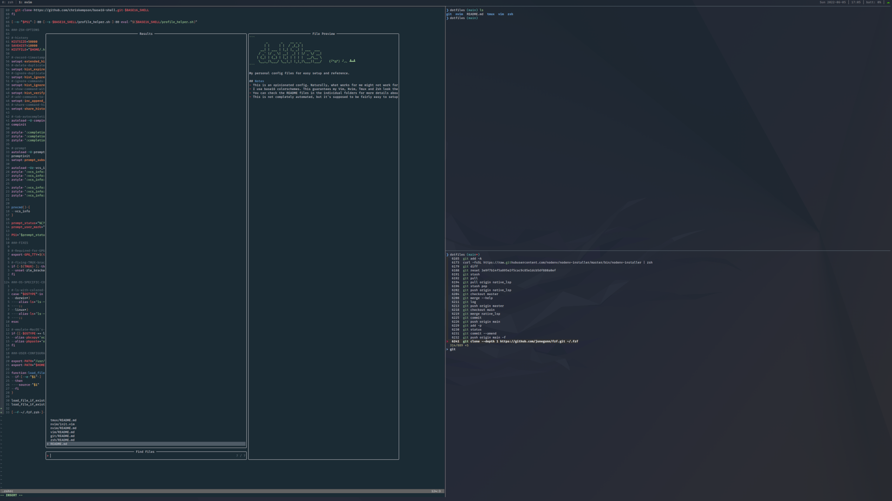

```
         _       _    __ _ _
        | |     | |  / _(_) |
      __| | ___ | |_| |_ _| | ___  ___
     / _` |/ _ \| __|  _| | |/ _ \/ __|
    | (_| | (_) | |_| | | | |  __/\__ \
     \__,_|\___/ \__|_| |_|_|\___||___/    (╯°□°）╯︵ ┻━┻
```

My personal config files for easy setup and reference.



## Notes
- This is an opinionated config. Naturally, what works for me might not work for you. If I don't use it, I remove it. You might find something that interests you in the commit history.
- You can check the README files in the individual folders for more details about the config.
- This is not completely automated, but it's supposed to be fairly easy to setup. In my experience, creating complex automation scripts for desktop setups, even though it's fun, does not pay off. The headstart provided by the dotfiles themselves is enough for me.

